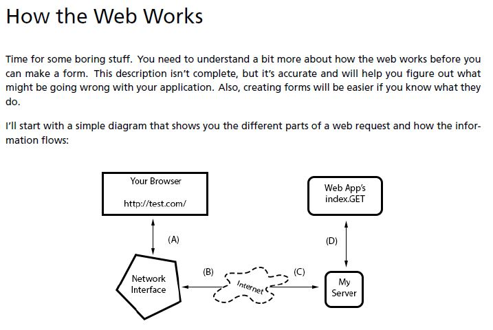
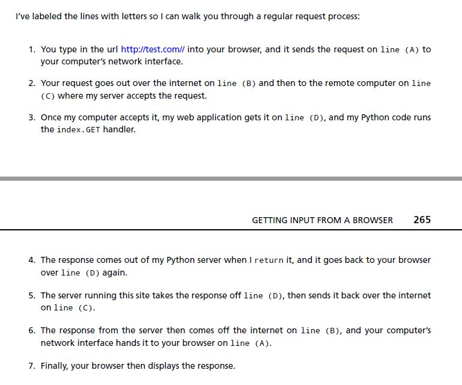
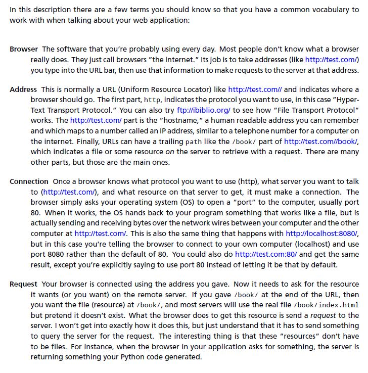
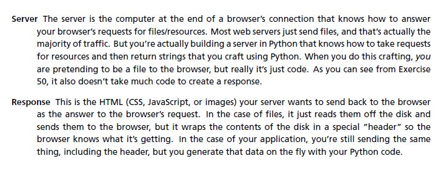
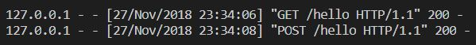
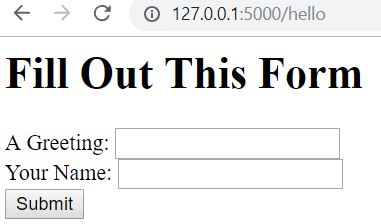
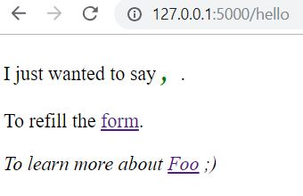

# Web development

## How the web works

That is the fastest crash course in how a web browser accesses information on servers on the internet.

It should work well enough for you to understand this exercise, but if not, read about it as much as you can until you get it. A really good way to do that is to take the diagram and break different parts of the web application you did in Exercise 50. If you can break your web application in predictable ways using the diagram, you’ll start to understand how it works.

## How Forms Work

1. Put parameters on the URL

Check [form-test.py](../exercise/ex50/gothonweb/form-test.py)

Then check the webpage with variables `name` and `greet`:

`http://localhost:5000/hello?name=Frank&greet=Hola.`

However, it looks ugly and not easy to use.....

2. HTML Forms

`POST form`: a special HTML file that has a <form> tag in it.

Check [app.py](../exercise/ex50/gothonweb/app.py) and [hello_form.html](../exercise/ex50/gothonweb/templates/hello_form.html)

Make a `POST` request when I hit `submit`.

Make a `GET` request when I hit `form`.

## Creating a Layout Template

Check [layout.html](../exercise/ex50/gothonweb/templates/layout.html)
and other html pages.

## Automated Tests for forms/webs

Check [app_tests.py](../exercise/ex50/gothonweb/tests/app_tests.py)